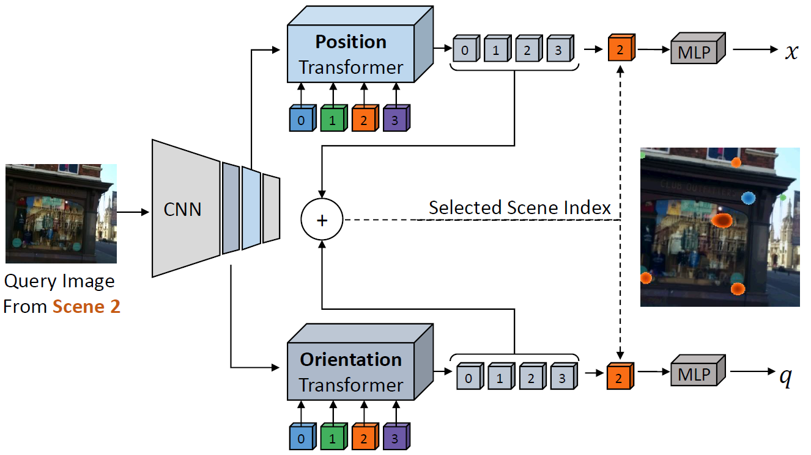

<div align="center">
<h2>Learning Multi-Scene Camera Pose Regression with Transformers (Oral ICCV2021)</h2>

[**Yoli Shavit**](https://yolish.github.io/) · [**Ron Ferens**](https://ronferens.github.io/) · [**Yosi Keller**](https://yosikeller.github.io/)

Bar-Ilan University

<a href="https://arxiv.org/abs/2103.11468"></a>
<a href='https://ronferens.github.io/multi-scene-pose-transformer/'></a>
</div>

Official PyTorch implementation of a multi-scene camera pose regression paradigm with Transformers, for details see our paper [Learning Multi-Scene Absolute Pose Regression with Transformers](https://arxiv.org/abs/2103.11468).  


The figure below illustrates our approach: two transformers separately attend to position-  and orientation- informative features from a convolutional backbone. Scene-specific queries (0-3) are further encoded with aggregated activation maps into latent representations, from which a
single output is selected. The strongest response, shown as an overlaid color-coded heatmap of attention weights, is obtained with the output associated with the input image's scene. The selected outputs are used to regress the position x and the orientation q.  


---

### Repository Overview 

This code implements:

1. Training of a Transformer-based architecture for multi-scene absolute pose regression 
2. Training of a PoseNet-like (CNN based) architecture for single scene pose regression
3. Testing of the models implemented in 1-2

---

### Prerequisites

In order to run this repository you will need:

1. Python3 (tested with Python 3.7.7, 3.8.5), PyTorch
2. Set up dependencies with ```pip install -r requirements.txt```
3. Download the [Cambridge Landmarks](http://mi.eng.cam.ac.uk/projects/relocalisation/#dataset) dataset and the [7Scenes](https://www.microsoft.com/en-us/research/project/rgb-d-dataset-7-scenes/) dataset


### Pretrained Models 
You can download our pretrained models for the 7Scenes dataset and the Cambridge dataset (before and after finetuning), from here: [pretrained models](https://drive.google.com/drive/folders/1wBoQ95A-YmQhxysEkri-ojl6PSnfMkdm?usp=sharing)

### Usage

The entry point for training and testing is the main.py script in the root directory

  For detailed explanation of the options run:)
  ```
  python main.py -h
  ```
  For example, in order to train our model on the 7Scenes dataset run: 
  ```
python main.py ems-transposenet train ./models/backbones/efficient-net-b0.pth /path/to/7scenes-datasets ./datasets/7Scenes/7scenes_all_scenes.csv 7Scenes_config.json
  ```
  Your checkpoints (.pth file saved based on the number you specify in the configuration file) and log file
  will be saved under an 'out' folder.
  
  To run on cambridge, you will need to change the configuration file to ```CambridgeLandmarks_config.json``` for initial training and ```CambridgeLandmarks_finetune_config.json``` for fine-tuning (see details in our paper). 
  
  In order to test your model, for example on the fire scene from the 7Scenes dataset:
  ```
  python main.py ems-transposenet test ./models/backbones/efficient-net-b0.pth /path/to/7scenes-datasets ./datasets/7Scenes/abs_7scenes_pose.csv_fire_test.csv 7Scenes_config.json --checkpoint_path <path to your checkpoint .pth>
  ```
 ### Citation 
 If you find this repository useful, please consider giving a star and citation:
```
@article{Shavit21,
  title={Learning Multi-Scene Absolute Pose Regression with Transformers},
  author={Shavit, Yoli and Ferens, Ron and Keller, Yosi},
  journal={arXiv preprint arXiv:2103.11468},
  year={2021}
}
